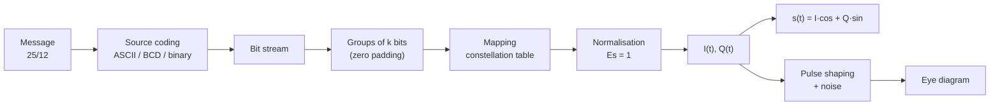

# Digital Modulations Lab — Excel signal generator

An interactive Excel workbook to teach digital wireless modulations. Students type a short message (for example their birthday, `DD/MM`), pick a modulation, and immediately see the bit stream, the I/Q baseband components, the modulated carrier, the constellation and the eye diagram.

> 🇫🇷 The workbook and the lab handout are in **French**. This README is in English.


---

## Features

- **Five modulations:** BPSK, QPSK, 8-PSK, 16-QAM and 32-QAM (cross constellation).
- **Three source codings:** ASCII (8 bits/character), BCD (4 bits/digit), direct binary input.
- **Four 16-QAM mappings from real standards:** IEEE 802.11 (Wi-Fi), 3GPP LTE / 5G NR / HSPA, DVB-T (ETSI EN 300 744), plus natural binary and a fully editable custom mapping.
- **Labelled constellation:** every point shows its bit pattern (e.g. `0101`), and the symbols actually transmitted are circled in red.
- **Eye diagrams** for the I and Q channels, with a rectangular or raised-cosine pulse shaping filter, adjustable roll-off α and additive Gaussian noise.
- **Built-in checks:** messages that are too long, non-binary characters, missing digits in BCD mode, too few samples per carrier cycle.
- **No macros:** plain `.xlsx` with formulas only, so it opens safely on school computers.

<p align="center">
  
</p>

---

## Quick start

1. Download `Modulations_Numeriques_Tableau.xlsx`.
2. Open it in Microsoft Excel 2016 or later (Microsoft 365 recommended) or LibreOffice Calc.
3. On the `Tableau_de_bord` sheet, edit the **yellow cells** only:

| Cell | Parameter | Values |
|---|---|---|
| `C4` | Modulation | BPSK, QPSK, 8-PSK, 16-QAM, 32-QAM |
| `C5` | Message | Text, e.g. `25/12` (the cell is formatted as text, so it is not converted into a date) |
| `C6` | Source coding | ASCII, BCD, direct binary |
| `C7` | Carrier cycles per bit | 0.25 to 5 |
| `C8` | 16-QAM protocol | Wi-Fi, LTE/5G, DVB-T, natural binary, custom |
| `L51` | Pulse shaping filter | Rectangular (NRZ), raised cosine |
| `L52` | Roll-off α | 0 to 1 |
| `L53` | Noise σ per channel | 0 to 1 (press **F9** to draw new noise) |

Everything else is recalculated automatically.

---

## How it works



### Workbook structure

| Sheet | Role |
|---|---|
| `Tableau_de_bord` | Inputs, results and all charts |
| `Bits` | Character → ASCII code → bits, and BCD conversion |
| `Symboles` | Bit grouping, symbol value, raw and normalised I/Q, amplitude, phase |
| `Signal` | 2000 samples of the modulated signal |
| `Oeil` | Raised-cosine coefficients and eye diagram traces |
| `Constellations` | Mapping tables for all modulations and 16-QAM protocols (editable) |
| `Exercice` | The 17 lab questions |

### Signal model and conventions

- **Constant bit rate.** Time is expressed in bit periods $T_b$. A symbol lasts $k \cdot T_b$, so a message has the same total duration whatever the modulation, with fewer and longer symbols for higher orders.
- **Modulated signal:** $s(t) = I \cdot \cos(2\pi f_c t) + Q \cdot \sin(2\pi f_c t)$. Some textbooks use $-Q \cdot \sin$; this only mirrors the constellation vertically.
- **Normalisation:** constellations are scaled so that the mean symbol energy is $E_s = 1$. Raw values (±1, ±3, ±5) are shown in the tables.
- **Bit order:** `b0` is the first transmitted bit, i.e. the most significant bit of the symbol value.
- **Padding:** when the number of bits is not a multiple of *k*, zeros are appended.

### Constellation mappings

| Modulation | Mapping |
|---|---|
| BPSK | bit 0 → −1, bit 1 → +1 |
| QPSK | bit 1 → I, bit 0 → Q, Gray |
| 8-PSK | phase = 45° × Gray position |
| 16-QAM | depends on the selected protocol (see below) |
| 32-QAM | cross constellation with a quasi-Gray mapping (a perfect Gray code is impossible on the cross; only 4 neighbouring pairs differ by 2 bits) |

### 16-QAM protocols

| Protocol | Rule | Reference |
|---|---|---|
| IEEE 802.11 (Wi-Fi) | `b0b1` → I, `b2b3` → Q, Gray per axis (00→−3, 01→−1, 11→+1, 10→+3) | IEEE 802.11a/g/n/ac/ax OFDM |
| 3GPP LTE / 5G NR / HSPA | I = (1−2b0)(1+2b2), Q = (1−2b1)(1+2b3) | 3GPP TS 36.211 §7.1.3, TS 38.211 §5.1.3, TS 25.213 |
| DVB-T | `y0` = sign of I, `y1` = sign of Q, `y2y3` = amplitude; top-left point = `1000` | ETSI EN 300 744, fig. 9 |
| Natural binary | `b0b1` → I in natural binary, `b2b3` → Q (not Gray) | Teaching reference |
| Custom | Editable table (columns AH–AI of `Constellations`) | Your own, or another standard (CDMA2000, ITU-T J.83…) |

### Eye diagram


- 16 samples per symbol, filter truncated to ±4 symbols.
- Each trace spans 2 symbols centred on a sampling instant (x = 0).
- The message is repeated cyclically so that the first and last symbols also produce complete traces.
- With the raised-cosine filter, all traces pass exactly through the symbol values at x = 0 (zero intersymbol interference).

---

## The lab

The lab handout is in [`docs/TP_Modulations_Numeriques.md`](docs/TP_Modulations_Numeriques.md) (French). It contains reminders, a guide to the workbook and 17 questions with tables to fill in:

| Part | Questions | Topic |
|---|---|---|
| 1 | 1–3 | By hand: ASCII coding, number of symbols, placing 16-QAM symbols |
| 2 | 4–8 | Checking with the dashboard: order vs duration, amplitude/phase changes, BCD, minimum distance |
| 3 | 9–11 | Gray coding, custom mapping, building a sequence that uses all 16 symbols |
| 4 | 12–14 | Comparing Wi-Fi, LTE/5G and DVB-T 16-QAM mappings, hierarchical modulation |
| 5 | 15–17 | Eye diagram: number of levels, roll-off trade-off, noise |

---

## Compatibility and limitations

- Designed for Microsoft Excel 2016 or later (Microsoft 365 recommended); formulas also verified in LibreOffice Calc.
- Messages are limited to **12 characters** in ASCII and BCD, and **96 bits** in direct binary.
- The `s(t)` and `I(t)/Q(t)` charts use rectangular pulses; pulse shaping is applied only on the eye diagram sheet.
- The noise uses `RAND()`, so the workbook recalculates the noise at every edit. Set σ to 0 to keep a fixed display.
- The 16-QAM mappings from standards describe only the bit-to-symbol mapping; scrambling, coding, interleaving and OFDM are not modelled.

---

## Repository structure

```
.
├── README.md
├── Modulations_Numeriques_Tableau.xlsx
└── docs/
    ├── TP_Modulations_Numeriques.md
    └── images/
        ├── dashboard.png
        ├── constellation.png
        └── eye_diagram.png
```

---

## Contributing

Suggestions and improvements are welcome: open an issue or a pull request. Ideas for future versions include 64-QAM, additional standard mappings, a noisy received constellation and a symbol error rate estimate.

## License

*To be defined by the author.* For teaching materials, a Creative Commons licence such as CC BY-SA 4.0 is a common choice.

## Author

Kiiway — engineering instructor, digital wireless communications.
